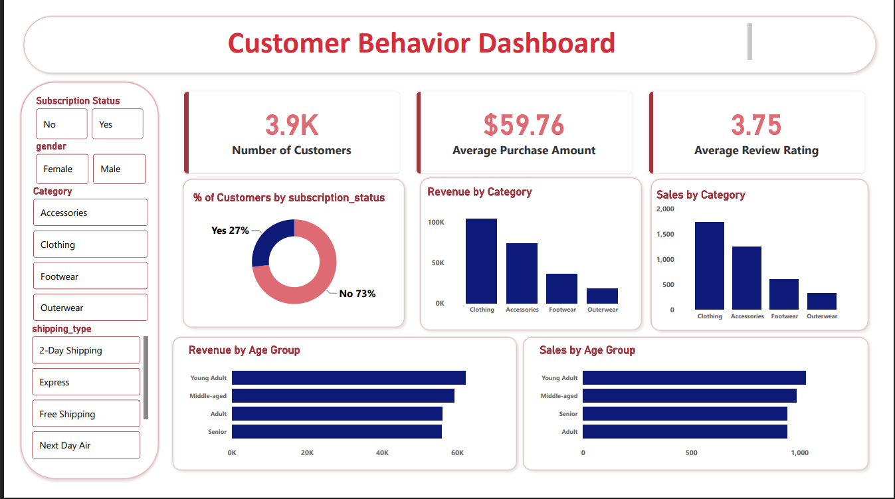

# 🛍️ Customer Shopping Behavior Analysis

> An end-to-end data analytics project analyzing 3,900 retail transactions to uncover spending patterns, customer segments, product preferences, and subscription behavior.

---

## 📌 Overview

This project walks through a complete data analytics pipeline — from raw data ingestion and Python-based EDA to SQL querying in PostgreSQL, an interactive Power BI dashboard, a written report, and a Gamma presentation.

The goal is to answer real business questions: *Who are our best customers? Which products drive the most revenue? Do discounts actually help or hurt margins?*

---

## 📂 Dataset

| Attribute | Details |
|---|---|
| **Source** | Kaggle — Customer Shopping Behavior Dataset |
| **Rows** | 3,900 transactions |
| **Columns** | 18 features |
| **Missing Data** | 37 null values in `review_rating` (imputed using category median) |

**Feature groups:**

- **Demographics** — `age`, `gender`, `location`, `subscription_status`
- **Purchase details** — `item_purchased`, `category`, `purchase_amount_usd`, `season`, `size`, `color`
- **Behavior** — `discount_applied`, `previous_purchases`, `frequency_of_purchases`, `review_rating`, `shipping_type`

---

## 🛠️ Tools & Technologies

| Layer | Tool |
|---|---|
| Language | Python 3.x |
| Data Analysis & Cleaning | Pandas, NumPy |
| Database | PostgreSQL |
| SQL Client | pgAdmin |
| BI Dashboard | Microsoft Power BI |
| Report | Google Docs / MS Word |
| Presentation | Gamma |

---

## 🔄 Project Workflow

### Step 1 — Load the Dataset
- Imported the CSV using `pandas`.
- Used `df.info()` and `df.describe()` to inspect structure, data types, and summary statistics.
- Confirmed 3,900 rows across 18 columns with one column (`review_rating`) containing 37 missing values.

### Step 2 — Exploratory Data Analysis (EDA)
Used pandas to explore the dataset statistically before cleaning:
- Age range: 18–70, mean age ~44
- Purchase amount range: $20–$100, median ~$60
- Gender split: Male-dominant in transaction count
- Reviewed value counts for categorical columns (category, season, shipping type, frequency)
- Visual exploration was done in Power BI after the data was cleaned and loaded

### Step 3 — Data Cleaning
- **Missing values:** Imputed `review_rating` nulls with the **median rating per product category** (category-level imputation preserves context better than a global median).
- **Column standardization:** Renamed all columns to `snake_case` for readability and SQL compatibility.
- **Feature engineering:**
  - Created `age_group` by binning customer ages into: Young Adult, Adult, Middle-aged, Senior.
  - Created `purchase_frequency_days` from the purchase frequency text column.
- **Redundancy check:** Verified that `discount_applied` and `promo_code_used` were effectively the same signal — dropped `promo_code_used`.
- **Database integration:** Pushed the cleaned DataFrame directly into PostgreSQL using `psycopg2` / SQLAlchemy.

### Step 4 — SQL Analysis (PostgreSQL)

Wrote 10 structured queries to answer key business questions:

| # | Query | Key Finding |
|---|---|---|
| 1 | Revenue by Gender | Male: $157,890 · Female: $75,191 |
| 2 | High-Spending Discount Users | 839 customers used discounts but spent above average |
| 3 | Top 5 Products by Rating | Gloves (3.86), Sandals (3.84), Boots (3.82) |
| 4 | Shipping Type Comparison | Express avg: $60.48 · Standard avg: $58.46 |
| 5 | Subscribers vs. Non-Subscribers | Avg spend nearly equal (~$59.50 vs $59.87) |
| 6 | Discount-Dependent Products | Hat (50%), Sneakers (49.66%), Coat (49.07%) |
| 7 | Customer Segmentation | Loyal: 3,116 · Returning: 701 · New: 83 |
| 8 | Top 3 Products per Category | Used `RANK()` window function per category |
| 9 | Repeat Buyers & Subscriptions | 2,518 repeat buyers are non-subscribers |
| 10 | Revenue by Age Group | Young Adult: $62,143 leads all segments |

> SQL query files are in the `/sql` folder.

### Step 5 — Power BI Dashboard
- Connected Power BI to the cleaned dataset.
- Built a single-page interactive dashboard with slicers for Subscription Status, Gender, Category, and Shipping Type.
- **KPI Cards:** 3.9K Customers · $59.76 Avg Purchase · 3.75 Avg Rating
- **Charts included:**
  - Donut chart — % of customers by subscription status (Yes 27% / No 73%)
  - Bar charts — Revenue and Sales by Category
  - Horizontal bar charts — Revenue and Sales by Age Group

### Step 6 — Report
- Documented the full project: objective, methodology, SQL findings, dashboard insights, and business recommendations.

### Step 7 — Presentation (Gamma)
- Built a structured presentation covering: problem statement → data overview → key findings → business recommendations.

---

## 📊 Dashboard

> **[🔗 View Power BI Dashboard](#)** 



**Dashboard KPIs at a glance:**

| Metric | Value |
|---|---|
| Total Customers | 3,900 |
| Average Purchase Amount | $59.76 |
| Average Review Rating | 3.75 / 5 |
| Subscription Rate | 27% |

---

## 💡 Key Results & Insights

1. **Male customers generated 2× the revenue** of female customers ($157,890 vs $75,191) — suggesting either a larger male customer base or higher purchase frequency.
2. **839 discount users still spent above average** — discounts aren't always cannibalizing margin; many high-value buyers also use them.
3. **73% of customers are non-subscribers**, yet their average spend ($59.87) is nearly identical to subscribers ($59.49) — subscription status does not predict spend level, but it does indicate loyalty potential.
4. **80% of the customer base (3,116) is already classified as Loyal**, with only 83 new customers — the brand retains well but may need stronger acquisition strategies.
5. **Young Adults (18–35) lead revenue at $62,143**, making them the highest-value age segment to target.
6. **Hat, Sneakers, and Coat have the highest discount dependency (~49–50%)** — pricing strategy for these products deserves review.
7. **Gloves rank #1 in customer rating (3.86)** despite not being a top-revenue product — a potential candidate for promotional spotlight.

---

## 📋 Business Recommendations

- **Boost subscriptions** — Only 27% subscribe; promote exclusive perks to convert the loyal non-subscriber base.
- **Revisit discount policy** — High-discount products (Hat, Sneakers) may be training customers to wait for deals; consider time-limited offers instead.
- **Target Young Adults** — Highest revenue group; tailor campaigns and product recommendations toward this segment.
- **Highlight top-rated products** — Surface Gloves, Sandals, and Boots in marketing to drive conversion using social proof.
- **Loyalty → Subscription pipeline** — 3,116 loyal customers are the ideal audience for a subscription upsell campaign.

---

## 🗂️ Repository Structure

```
customer-shopping-behavior/
│
├── data/
│   └── customer_shopping_behavior.csv      
│
├── notebooks/
│   └── csb.Analysis.ipynb         
│   └── customer_behavior.sql           
│
├── dashboard/
│   └── customer_behavior.pbix         
│   └── customer_shopping_behavior_Analysis.pdf            
│   └── customer_shopping_behavior_Analysis.pptx
    
│
├── assets/
│   └── dashboard_preview.png          
│
└── README.md
```

---

## ▶️ How to Run

### 1. Clone the repository
```bash
git clone https://github.com/your-username/customer-shopping-behavior.git
cd customer-shopping-behavior
```

### 2. Install Python dependencies
```bash
pip install pandas numpy  psycopg2-binary sqlalchemy
```

### 3. Run the Python notebook
Open `notebooks/csb.Analysis.ipynb` in Jupyter Notebook or VS Code and run all cells.

### 4. Set up PostgreSQL
- Create a database named `shopping_db` (or update the connection string in the notebook).
- The notebook will automatically push the cleaned DataFrame to PostgreSQL.
- Run additional queries from `/sql/ customer_behavior.sql` in pgAdmin.

### 5. Open the Power BI Dashboard
- Open `dashboard/customer_behavior.pbix` in Power BI Desktop.
- Update the data source path if needed and click **Refresh**.

